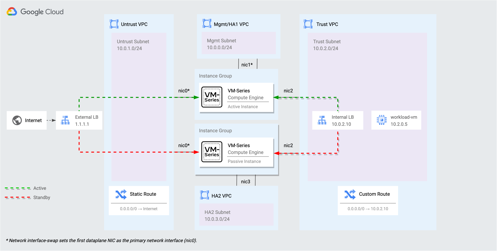
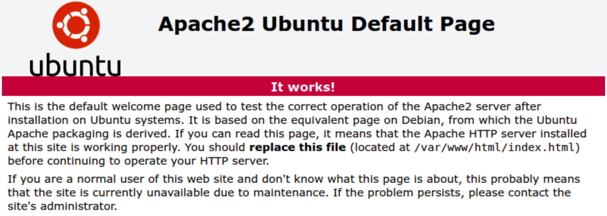
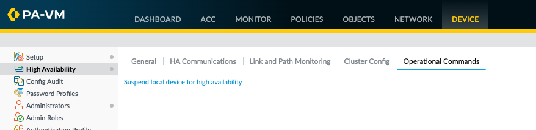
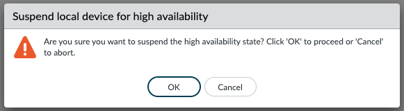

# VM-Series Active/Passive HA on Google Cloud

This tutorial creates a pair of Active/Passive VM-Series firewalls on Google Cloud.   This architecture provides the following benefits:
* Configuration sync between the VM-Series firewalls.
* State synchronization between instances to maintain state on failover.


The autoscale architecture is recommended in most use-cases.  Please see [VM-Series on Google Cloud](https://cloud.google.com/architecture/partners/palo-alto-networks-ngfw) for more information on VM-Series deployment models.


## Architecture

This deployment model provides solutions for the following key use-cases:

* IPSec termination of site-to-site VPNs.
* Legacy applications that need visibility of the original source client IP (No SNAT solution) for inbound traffic flows.
* Requirements for session fail-over on failure of VM-Series.



## Prepare for deployment

1. Enable the required APIs, generate an SSH key, and clone the repository. 

    ```
    gcloud services enable compute.googleapis.com
    ssh-keygen -f ~/.ssh/vmseries-tutorial -t rsa
    git clone https://github.com/wwce/google-cloud-vmseries-ha-tutorial
    cd google-cloud-vmseries-ha-tutorial
    ```

2. Create a `terraform.tfvars` file.

    ```
    cp terraform.tfvars.example terraform.tfvars
    ```

3. Edit the `terraform.tfvars` file and set values for the following variables:

    | Variable      | Description                                    |
    |-----------------|----------------------------------------------------------------------------------|
    | `project_id `     | Set to your Google Cloud deployment project.                                     |
    | `public_key_path` | Set to match the full path you created previously.                               |
    | `mgmt_allow_ips`  | Set to a list of IPv4 ranges that can access the VM-Series management interface. |
    | `prefix`          | (Optional) If set, this string will be prepended to the created resources.       |
    | `vmseries_image_name`          | (Optional) Defines the VM-Series image to deploy.  A full list of images can be found [here](https://docs.paloaltonetworks.com/vm-series/11-0/vm-series-deployment/set-up-the-vm-series-firewall-on-google-cloud-platform/deploy-vm-series-on-gcp/use-custom-templates-or-the-gcloud-cli-to-deploy-the-vm-series-firewall).       |

4. (Optional) If you are using BYOL image (i.e. `vmseries-flex-byol-*`), the license can be applied during deployment by adding your VM-Series authcode to `bootstrap_files/authcodes`.
5. Save your `terraform.tfvars` file.


## Deployment
When no further changes are necessary in the configuration, deploy the resources:

1. Initialize and apply the Terraform plan.  

    ```
    terraform init
    terraform apply
    ```

2. Enter `yes` to start the deployment.
   
3. After all the resources are created, Terraform displays the following message:

    ```
    Apply complete!

    Outputs:

    EXTERNAL_LB_IP    = "ssh paloalto@1.1.1.1 -i ~/.ssh/vmseries-tutorial"
    EXTERNAL_LB_URL    = "https://1.1.1.1"
    VMSERIES_ACTIVE    = "https://2.2.2.2"
    VMSERIES_PASSIVE   = "https://3.3.3.3"
    ```

## Test the deployment

We can now test the deployment by accessing the `workload-vm` that resides in the trust VPC network.  All of the `workload-vm` traffic is routed directly through the VM-Series HA pair. 

1. Verify the deployment is ready. Use the output `EXTERNAL_LB_URL` to access the web service on the `workload-vm` through the VM-Series firewall.

    

2. Use the output `EXTERNAL_LB_SSH`  to open an SSH session through the VM-Series to the `workload-vm`.  


3. A script has been preloaded to the workload VM.  Run the script to test the failover mechanism across the VM-Series firewalls.
    ```
    /network-check.sh
    ```

    You will see output like this where `x.x.x.x` is the IP address is `EXTERNAL_LB_IP` address.
    ```
    Wed Mar 12 16:40:18 UTC 2023 -- Online -- Source IP = x.x.x.x
    Wed Mar 12 16:40:19 UTC 2023 -- Online -- Source IP = x.x.x.x
    Wed Mar 12 16:40:20 UTC 2023 -- Online -- Source IP = x.x.x.x
    Wed Mar 12 16:40:21 UTC 2023 -- Online -- Source IP = x.x.x.x
    ```

4. Login to the VM-Series firewalls using the `VMSERIES_ACTIVE` and `VMSERIES_PASSIVE` output values.
    ```
    UN: admin
    PW: Pal0Alt0@123 
    ```

5. After login, take note of the HA Status in the bottom right corner on each firewall.

    <b>Active Firewall</b></br>
    

    <b>Passive Firewall</b></br>
    

6. Perform a user initiated failover.
   1. On the ***Active Firewall***, go to the **Device → High Availability → Operational Commands**.
   2. Click **Suspend local device for high availability**.
        
   3. When prompted, click **OK** to initiate the failover.</br>
        

7. You should notice your SSH session to the `workload-vm` is still active.  This indicates the session successfully failed over between the VM-Series firewalls.  The script output should also display the same source IP address.
    ```
    Wed Mar 12 16:47:18 UTC 2023 -- Online -- Source IP = x.x.x.x
    Wed Mar 12 16:47:19 UTC 2023 -- Online -- Source IP = x.x.x.x
    Wed Mar 12 16:47:21 UTC 2023 -- Offline
    Wed Mar 12 16:47:22 UTC 2023 -- Offline
    Wed Mar 12 16:47:23 UTC 2023 -- Online -- Source IP = x.x.x.x
    Wed Mar 12 16:47:24 UTC 2023 -- Online -- Source IP = x.x.x.x
    ```

## Clean up

To avoid incurring charges to your Google Cloud account for the resources you created in this tutorial, delete all the resources when you no longer need them.

1. Run the following command
    ```
    terraform destroy
    ```

2. At the prompt to perform the actions, enter `yes`. 
   
   After all the resources are deleted, Terraform displays the following message:

    ```
    Destroy complete!
    ```

## Additional information

* Learn about the[ VM-Series on Google Cloud](https://docs.paloaltonetworks.com/vm-series/10-2/vm-series-deployment/set-up-the-vm-series-firewall-on-google-cloud-platform/about-the-vm-series-firewall-on-google-cloud-platform).
* Getting started with [Palo Alto Networks PAN-OS](https://docs.paloaltonetworks.com/pan-os). 
* Read about [securing Google Cloud Networks with the VM-Series](https://cloud.google.com/architecture/partners/palo-alto-networks-ngfw).
* Learn about [VM-Series licensing on all platforms](https://docs.paloaltonetworks.com/vm-series/10-2/vm-series-deployment/license-the-vm-series-firewall/vm-series-firewall-licensing.html#id8fea514c-0d85-457f-b53c-d6d6193df07c).
* Use the [VM-Series Terraform modules for Google Cloud](https://registry.terraform.io/modules/PaloAltoNetworks/vmseries-modules/google/latest). 